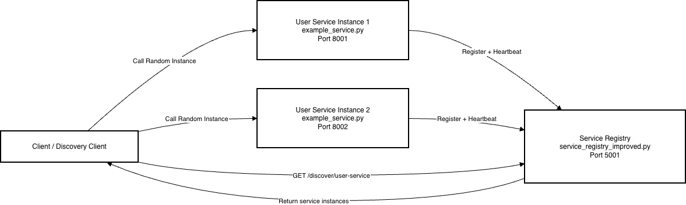
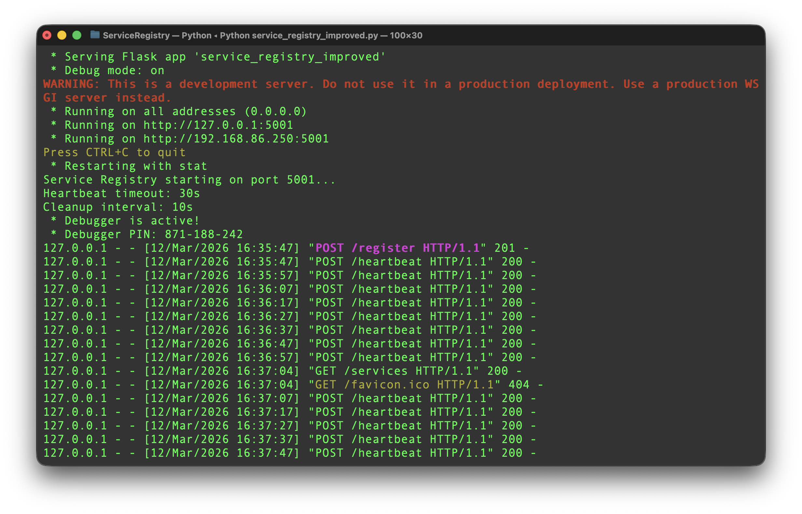
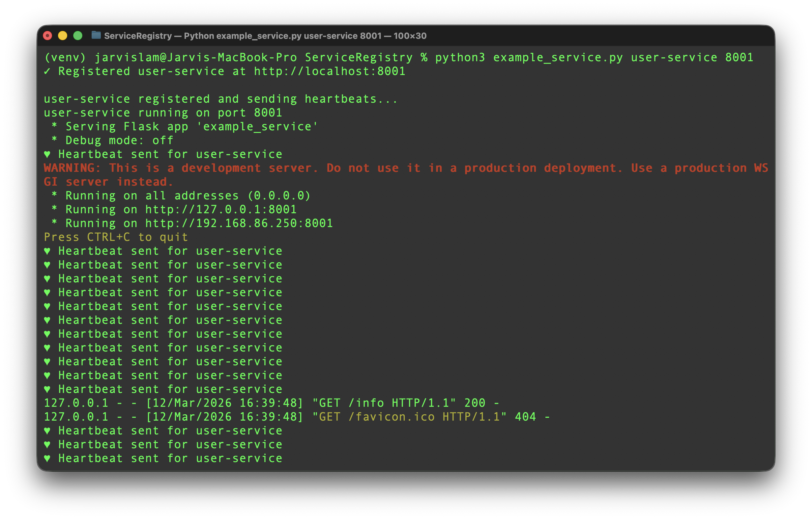
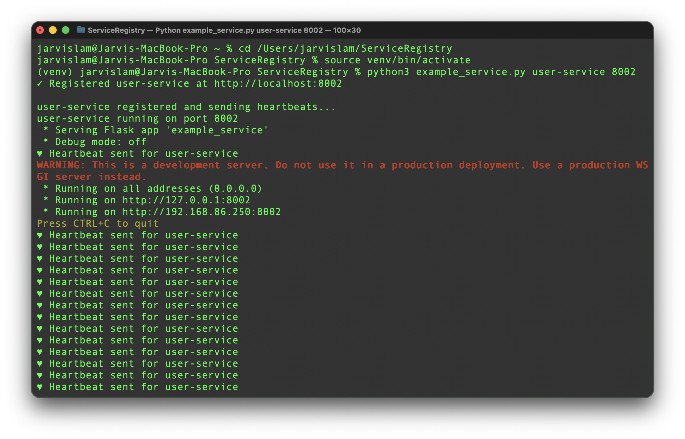
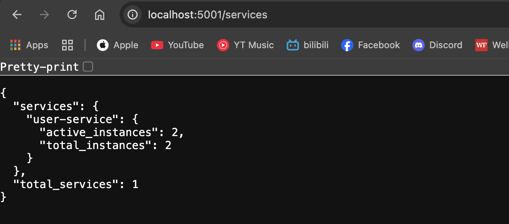
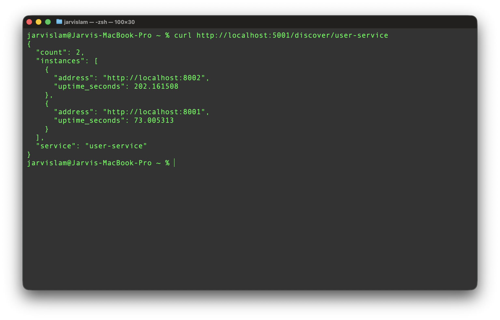
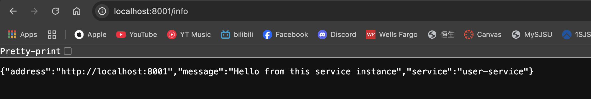

# CMPE 273 Week7 Assignment – Naming and Service Discovery
This project demonstrates a microservice service discovery system using a Service Registry pattern.

The system allows multiple service instances to register themselves with a central registry. A client can then discover available services and randomly call one instance.

# Project Overview
This assignment demonstrates the following distributed system concepts:
• Service registration
• Service discovery
• Multiple service instances
• Heartbeat health monitoring
• Client-side load balancing (random instance selection)

# System Architecture


# How to run
## 1. Open project folder
Navigate to the folder containing your Python files.
```bash
cd ServiceRegistry
```

## 2. Create a Python virtual environment
(macOS / Linux)
```bash
python3 -m venv venv
source venv/bin/activate
```

Windows:
```bash
python -m venv venv
venv\Scripts\activate
```

## 3. Install dependencies
```bash
pip install -r requirements.txt
```

## 4. Start the Service Registry
Open Terminal 1 and run:
```bash
python service_registry_improved.py
```


The registry is now running at:
http://localhost:5001
This component acts as the service discovery registry.

## 5. Start Service Instance #1
Open Terminal 2:
```bash
python example_service.py user-service 8001
```
Example output:


## 6. Start Service Instance #2
Open Terminal 3:
```bash
python example_service.py user-service 8002
```
Example output:


At this point, you now have:
- 2 service instances
- both registered with the registry
- both sending heartbeats

## 7. Verify services are registered
Open a browser or use curl:
```bash
http://localhost:5001/services
```
Example output:

This proves that both services registered successfully.

## 8. Discover the service
Run:
```bash
curl http://localhost:5001/discover/user-service
```

This demonstrates service discovery.

## 9. Call the service instances
Test each instance directly.
Instance 1:
```bash
http://localhost:8001/info
```
Instance 2:
```bash
http://localhost:8002/info
```
Example response:


